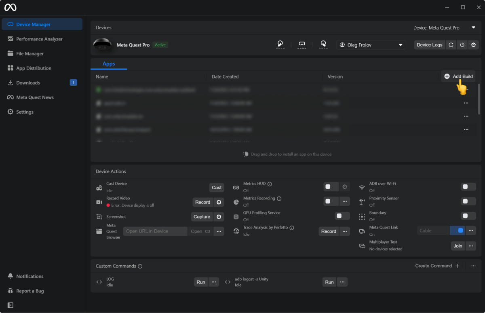
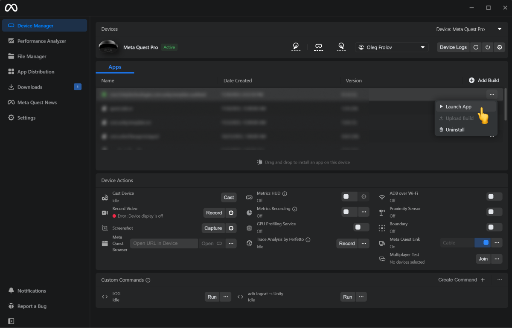
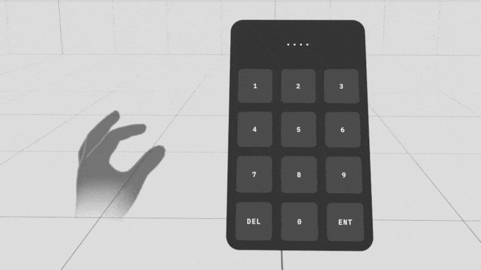
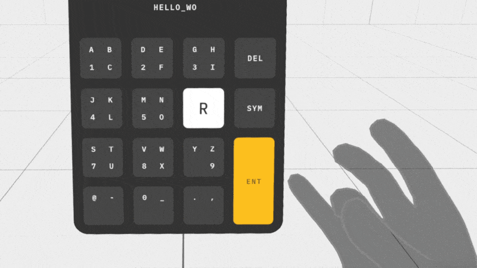
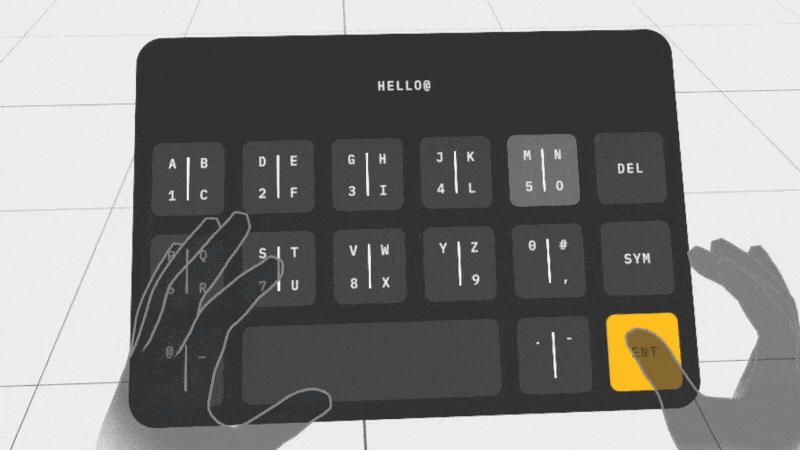
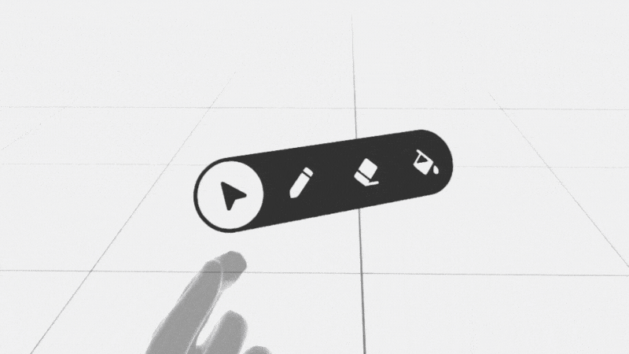
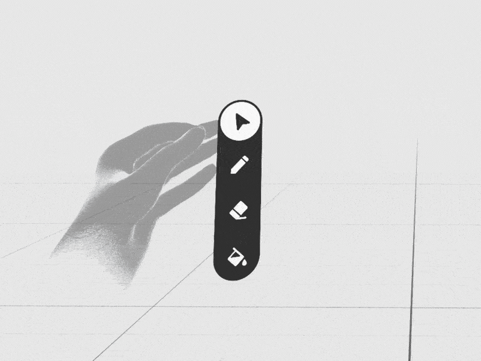
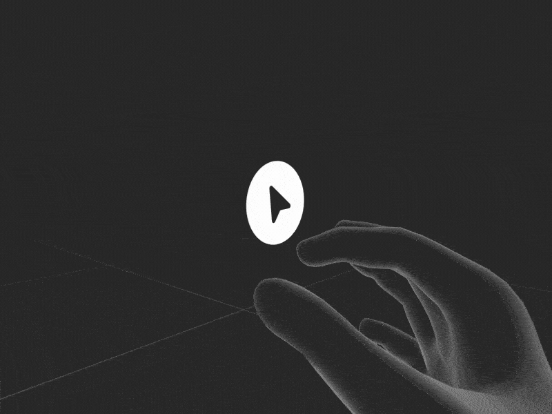

# XR Prototypes

A collection of my XR prototypes as apk files. All apk files are in the `Builds` folder.

- [Numeric Keyboard with Eye Tracking](#numeric-keyboard-with-eye-tracking)
- [Keypad with Eye and Hand Tracking](#keypad-with-eye-and-hand-tracking)
- [Keypad with Eye and Hand Tracking 2](#keypad-with-eye-and-hand-tracking-2)
- [Fingertips Menu](#fingertips-menu)
- [Horizontal Finger Menu](#horizontal-finger-menu)
- [Vertical Finger Menu](#vertical-finger-menu)
- [Depth Finger Menu](#depth-finger-menu)

## How to install an apk
The simplest way to do it is to intall the apps via [Meta Quest Developer Hub](https://developer.oculus.com/downloads/package/oculus-developer-hub-win/).

### 1. Add an app to MQDH
Press the `Add Build` button and select an app on your disk.

### 2. Launch the app
Open the context menu ("three dots") and hit the `Launch App` button.

## Numeric Keyboard with Eye Tracking

Prototyped a numeric keypad with eye-tracking and hand-tracking inputs similar to what we saw on Apple's Vision Pro demo. I used Oculus Integration and ran it on Quest Pro (it's the only Quest that supports eye-tracking).

It feels very natural and familiar. We already use the same principles for regular keyboard-based, non-blind typing. First, you visually allocate a target, and then your hand confirms an intended action. But the eye-tracking version is less laborious since this hand confirmation is remote, and you don't need to "physically" interact with the keyboard. 

- [Download APK](https://github.com/Volorf/xr-prototypes/blob/main/Builds/154_numeric_keyboard_with_eye_tracking.zip)
- [Learn more](https://twitter.com/Volorf/status/1721833148957241494)

## Keypad with Eye and Hand Tracking

I made a prototype inspired by a telephone keypad. It uses eye-tracking to hover over a key and finger pinches to define which letter you will type. 

As you can see, each key encodes up to 4 signs (with SYM mode, it's 8) in a single mode:

**Pinch Invocation**:
1. `Index`  -> Top Left     -> "A"
2. `Middle` -> Top Right    -> "B"
3. `Ring`   -> Bottom Right -> "C"
4. `Pinky`  -> Bottom Left  -> "1"

**Observations**:
- Sometimes, during typing, I accidentally triggered the system menu. Adding visual signifiers to the virtual hand to specify a dedicated typing mode would help. It would visually guide users to stay in the mode. Or, OS holders might add the signifiers to the mode where you invoke system commands. The point is it should be easy for users to recognize when they switch from an app interaction layer to a system one.
- The current Computer Vision-based hand tracking is not reliable enough. There are a lot of false positives for detecting Ring/Pinky Pinches. A dedicated hand-tracking device would improve the experience. As a quick hack — since there are no significant issues with Index/Middle pinches recognition — to type the left side symbols ("A 1" column), you use index/middle pinches on your left hand, and for the right side ones ("B C" column), you use your right hand respectively.
- The key layout doesn't consider the letters' use frequency. Arranging the layout based on it would speed up typing dramatically. But it would involve training and make the learning curve steeper.
- Smart suggestions ("T9") would allow us to use only Index Pinch for typing.

Overall, it's a very promising approach that massively reduces physical fatigue for spatial typing. With dedicated, accurate hand-tracking devices, input systems like this will make spatial interactions truly approachable.

- [Download APK](https://github.com/Volorf/xr-prototypes/blob/main/Builds/156_keypad_with_eye_tracking.zip)
- [Learn more](https://www.linkedin.com/posts/oleg-frolov-6a6a4752_xr-vr-ar-activity-7129774599726067712-bfNc)

## Keypad with Eye and Hand Tracking 2

Prototyped another variation of the previous keypad concept with eye-tracking. Quest Pro didn't track Ring/Pinky pinches accurately, so I used both hands to leverage only the Index and Middle pinches for decoding key signs.

**Pinch Invokation Map**:
1. `Left Index`     -> Top Left     -> "A"
2. `Left Middle`    -> Bottom Left  -> "1"
3. `Right Index`    -> Top Right    -> "B"
4. `Right Middle`   -> Bottom Right -> "C"

As you can see, the left hand decodes the left side of a key's signs, and the right hand does the right side, retrospectively. The mapping feels natural, and there are no significant issues with detecting the Index/Middle pinches. The typing experience is comfortable and fairly quick, with minimal physical strain. You use your eyes to select and your hands to 'click' - either resting on a table or on your lap.

There's room for improvement in the layout. One might arrange the most frequently used letters near the keyboard's center to minimize eye movement. It would be especially beneficial for professionals who prioritize speed and efficiency. Learning a new layout would pay off.

However, a layout with a sequential order of signs is more practical for everyday users. Since most people are familiar with the alphabetical order and basic counting, this knowledge will help them locate the desired letter easily.

The sorted order of the signs on the keypad enables users to leverage a binary search strategy to find a specific sign. This method has an `O(log n)` complexity, which is more efficient than the `O(n)` complexity for unsorted sequences. Therefore, a layout with a sorted sequence of signs is more effective for the majority.

By the way, this point above is one of the reasons why there is no sense in using QWERTY for spatial inputs like this: 1. You can't leverage your muscle memory because of the lack of haptic feedback and the wrong posture; 2. It's an arbitrary unsorted sequence from the common sense perspective.

- [Download APK](https://github.com/Volorf/xr-prototypes/blob/main/Builds/156_keypad_with_eye_tracking_2.zip)
- [Learn more](https://www.linkedin.com/posts/oleg-frolov-6a6a4752_xr-vr-ar-activity-7137399767503925249-bBLH)

## Fingertips Menu

When I shared my last interaction concept for a spatial hand-based menu, some people asked why I didn't put the menu on the fingertips since it would provide haptic feedback and, therefore, it would increase the accuracy and the interaction speed.

I did a few prototypes with this type of interaction in the past, and, indeed, it worked very well. But, as with everything in Design, the answer to the "Is it good?" question is "It depends™™™".

Several things are worth considering when you design spatial interactions like this for your product.

1. **Interference with system actions**. Since these gestures are extremely easy to perform, it's more likely that OS holders will reserve them for system calls. Meta OS already uses the index pinch-pressed gesture (when you look at your palm) to show the system menu. Other pinches they might reserve for custom quick actions to allow users to assign their own (calling a recorder or writing a message to a friend, etc.).

2. **Finite number of fingers**. It means that you can't scale the menu. If you need to add more items, you won't be able to do that.

3. **Controllers support**. If your app supports controllers, you must create a separate navigation to support them. It will confuse users since you can switch from controllers to hands and vice versa in runtime. Again, it might work for simple cases. Still, generally speaking, it brings a lot of challenging restrictions to your design process because you will need to maintain two navigation modes simultaneously. It may cause a situation when you have two distinguished interaction paradigms in one app. It will make the learning curve for your app steeper.

4. **Avatars**. Some products might have avatars. If your users can use avatars like a mutant ninja turtle with three fingers, an avatar with big hands, or without hands at all, you will need to support all the modes for navigation. And if your users can switch the avatars in runtime, constantly changing between different navigation patterns might challenge the app's usability.

5. **Accessibility**. In my previous concept, I used heavy settings for the lazy follower function that smoothed hand tremors. It significantly simplified the UI aiming task. You can't do this with this fingertip-based approach because the menu items are anchored to the fingers, and you must maintain their spatial proximity to map the visual signifiers (icons) with the actions (pinches). For people with hand tremors (or in a poor lighting environment that makes hand-tracking inaccurate), rigidly attached to fingertip buttons may look uncomfortable. However, this smoothing might work with only one button since, perceptually, you attach it to the whole hand. 

So, it's a very powerful pattern but use it wisely!

- [Download APK](https://github.com/Volorf/xr-prototypes/blob/main/Builds/150_fingertip_menu.zip)
- [Learn More](https://www.linkedin.com/posts/oleg-frolov-6a6a4752_xr-vr-interactiondesign-activity-7122512743974191104-ePy-?utm_source=share&utm_medium=member_desktop)

## Horizontal Finger Menu 

Prototyped another version of my earlier spatial finger menu concept. In this iteration, the menu remains stationary once you start pinching.

Keep these points in mind with this design:
1. A short trigger distance for state switching can lead to false positives. Be cautious with the UI's size and layout - ideally, the triggering distance should align with the spacing between elements for a smoother transition. In the previous design, I used an animated offset that followed your movements, which masked the longer triggering distance and made it more tolerant of hand-tracking errors and inaccuracies. If false positives become an issue, consider reverting to that first version.
2. Use the fixed mode only within the specific range needed to trigger state changes. Once you hit the limit, switch back to the following mode. This approach prevents the violation of the proximity principle, where the user input is too distant from an interactive element. Additionally, it ensures the interaction remains fluid and natural, freezing the UI only when necessary.

- [Download APK](https://github.com/Volorf/xr-prototypes/blob/main/Builds/162_boxelxr_finger_menu_horizontal_static.zip)
- [Learn More](https://www.linkedin.com/posts/oleg-frolov-6a6a4752_spatialdesign-spatialui-spatialux-activity-7141347907743477760-rqRe)
- [BoxelXR (Spatial Voxel Editor)](https://www.meta.com/en-gb/experiences/5815420721867244/)

## Vertical Finger Menu 

Here is another iteration of the finger toolbar for my Spatial Voxel Editor — Boxel.

Right now, the app completely relies on controllers. Haptic feedback and low latency make the interactions easy to trigger and fast to execute. Plus, you can develop muscle memory, which increases the interaction speed to the thought level.

My plan is to rethink the whole approach and make the editor hand-tracking first while having controllers as an additional mode for expert users (which might also lead to the creation of a separate app if it turns out that there are many compromises in terms of UX I have to do).

I have already tried the X-axis-based approach. This one leverages the Y. And, as you might guess, my next experiment will use the Z axis.

- [Download APK](https://github.com/Volorf/xr-prototypes/blob/main/Builds/164_boxelxr_finger_menu_vertical.zip)
- [Learn More](https://twitter.com/Volorf/status/1760195472969343437)

## Depth Finger Menu

Explored the finger menu with a depth-based layout. Felt fun. Microinteractions/UI motion helped to compensate for the lack of haptic feedback by providing rich visual clues and reinforcing the user's intentions (all these subtle micro-movements).

Based on the prototype, here are a few things to consider when you use this interaction pattern:

1. Perspective visual distortion. It might take more time to recognize visually distorted signs when they are arranged by depth. It's a good idea to use well-known sign sequences where the current selected element gives you a hint about the previous and next ones. A user should have an embedded knowledge of how the elements in the menu are sorted. A number selector might work well with it. [Like this](https://dribbble.com/shots/18072951-VR-Slider-Prototype-Hand-Tracking-Direct-Manipulation).

2. Low range of hand movement in stationary mode. Because you need to keep visual contact with the UI, the useful range of possible hand movement is very limited. You must position your hand in front of your eyes, maintaining a comfortable distance. It restricts the number of items you can have on the menu. Plus, the trigger distance (30-40mm) also reduces the amount of menu elements you can use. Two or three items work the best (four is max).

- [Download APK](https://github.com/Volorf/xr-prototypes/blob/main/Builds/173_boxelxr_finger_menu_depth.zip)
- [Learn More](https://twitter.com/Volorf/status/1764565204350775468)